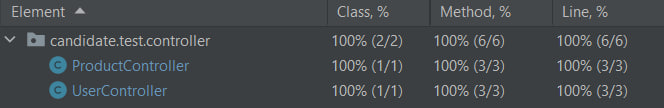

# Test Task for ExpandAPIs

## Prerequisites

Ensure that you have Java, Maven, and MySQL installed on your system. Additionally, set up a MySQL database and provide the necessary credentials in the application.properties file.

## Getting Started

To run the application locally, clone the repository and follow the configuration and execution instructions. The application will expose API endpoints for user management, authentication, and product record management.

## Configuration

To configure the database, specify the data for connecting to your database in application.properties
```
spring.datasource.url=jdbc:mysql://localhost:3306/your_database
spring.datasource.username=your_username
spring.datasource.password=your_password
spring.datasource.driver-class-name=com.mysql.cj.jdbc.Driver
spring.jpa.hibernate.ddl-auto=create-drop
```

To configure JWT token specify the data for JWT token in application.properties
```
jwt.expiration=your_expiration
jwt.secretString=your_secret_string
```

## API Endpoints
### List of endpoints that were required by the task conditions

### 1. /user/add (POST)
* __Input__: JSON payload, example:
  ```
    {
        "username": "johndoe",
        "password": "password",
        "repeatPassword": "password",
        "firstName": "John",
        "lastName": "Doe"
    }
    ```
* __Output__: Response indicating success or failure and the next JSON:
  ```
    {
        "username": "johndoe",
        "firstName": "John",
        "lastName": "Doe"
    }
    ```

### 2. /user/authenticate (POST)
* __Input__: JSON payload, example:
  ```
    {
        "username": "johndoe",
        "password": "password",
    }
    ```
* __Output__: JWT access-token on successful authentication;
  ```
    {
        "token": "jwt"
    }
    ```

### 3. /products/add (POST)
* __Input__: JSON payload, example:
  ```
    "records" : [
    {
        "entryDate": "2023-03-21",
        "itemCode": "11111",
        "itemName": "Test Inventory 1",
        "itemQuantity": "20",
        "status": "Paid"
    },
    {
        "entryDate": "2023-03-21",
        "itemCode": "11111",
        "itemName": "Test Inventory 2",
        "itemQuantity": "1",
        "status": "Paid"
    }] }
    ```
* __Output__: Status code indicating success or failure
* __Authentication__: Required

### 4. /products/all (GET)
* __Output__: JSON array containing all records in the "products" table, for examle:
  ```
  {
        "records": [
            {
                "id": 1,
                "entryDate": "2023-03-21",
                "itemCode": "11111",
                "itemName": "Test Inventory 1",
                "itemQuantity": 1,
                "status": "Paid"
            },
            {
                "id": 2,
                "entryDate": "2023-03-21",
                "itemCode": "11111",
                "itemName": "Test Inventory 2",
                "itemQuantity": 1,
                "status": "Paid"
            },
            {
                "id": 3,
                "entryDate": "2023-03-21",
                "itemCode": "11111",
                "itemName": "Test Inventory 1",
                "itemQuantity": 20,
                "status": "Paid"
            },
            {
                "id": 4,
                "entryDate": "2023-03-21",
                "itemCode": "11111",
                "itemName": "Test Inventory 2",
                "itemQuantity": 1,
                "status": "Paid"
            }
        ]
    }
  ```
* __Authentication__: Required

## Tests

 Integration tests cover 100% of the application
